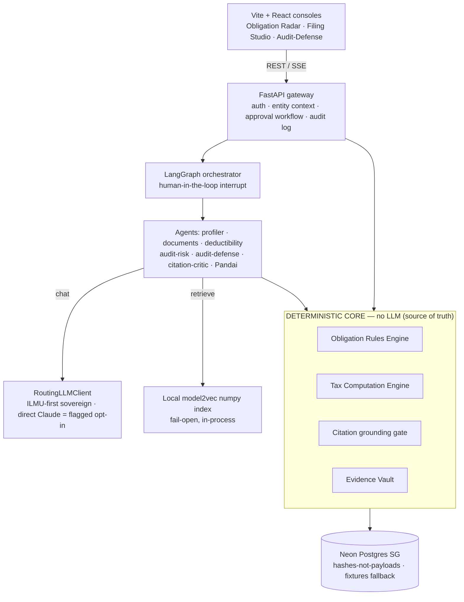
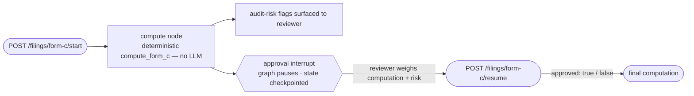
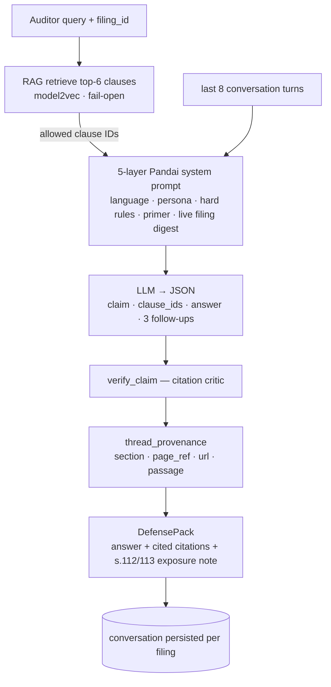
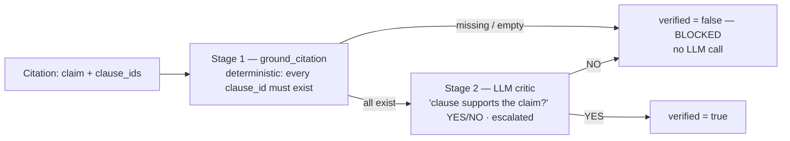
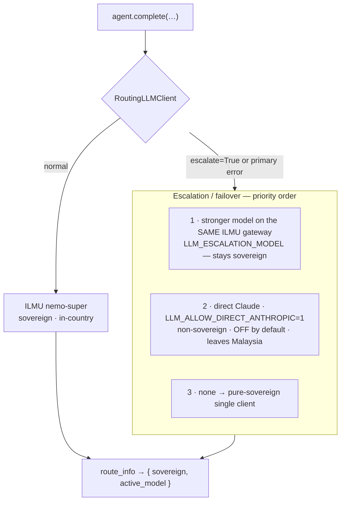
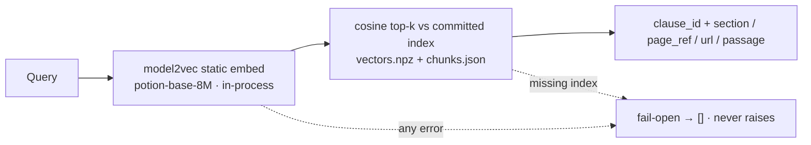

<div align="center">


# CukaiPandai

### Sovereign, Citation-Grounded AI Tax Assurance for Malaysian Enterprises

_Obligation calendar · cited Form C filing · audit defense — **every figure traceable to its source + the law that justifies it.**_

<br/>

<p>
  
</p>

<p>
  
  
  
  
  
  
  
  
</p>

<br/>


<br/>

[**Live Demo**](https://cukaipandai.vercel.app/) · [**Pitch Deck**](docs/demo/cukaipandai-pitch-deck.pdf) · [**Docs**](#-docs) · [**Architecture**](#-how-it-works) · [**Quickstart**](#-getting-started) · [**Demo**](#-demo)

</div>

---

> **🏛 NexHack 2026 · Track 1 — Agentic AI for Internal Enterprise Operations** · Sponsor/host: **Xenber Sdn. Bhd.**
> Built by **Chaos** (backend / agents), **Tuna** (frontend / demo), and **Lama** (testing / QA).

---

## ✨ At a Glance

<table>
  <tr>
    <td align="center"><strong>0</strong><br/><sub>hallucinated figures — the deterministic core computes, a verifier rejects fabricated citations</sub></td>
    <td align="center"><strong>88 / 14</strong><br/><sub>fixed tax accounts across 14 groups driving the full Form C ascertainment chain</sub></td>
    <td align="center"><strong>250</strong><br/><sub>backend tests across 50 files, run fully offline (no API key)</sub></td>
    <td align="center"><strong>100%</strong><br/><sub>in-country inference on the prelim — ILMU <code>nemo-super</code>, PDPA-aligned</sub></td>
  </tr>
</table>

---

## 🎬 Demo

- 🌐 **Live demo:** **<https://cukaipandai.vercel.app/>**
- ▶️ **Demo video:** _TODO — paste the YouTube / Loom link here_ &nbsp;`<!-- [Watch the demo](VIDEO_URL) -->`
- 🖼 **Screenshots:** _TODO — add console captures (Obligation Radar · Filing Studio · Audit Assistant)_

<!-- Screenshot grid placeholder — uncomment and point at real images when captured:
<table>
  <tr>
    <td width="33%"></td>
    <td width="33%"></td>
    <td width="33%"></td>
  </tr>
</table>
-->

---

## 🧠 What CukaiPandai Does

Malaysia's tax system is digitalising fast — mandatory **MyInvois** e-invoicing, expanded **SST**, new **CGT** — so enterprises must file **more, more accurately, with a permanent audit trail**, exactly as LHDN's audit posture sharpens (penalties under **ITA 1967 s.112/s.113**). Existing tooling stops short: MyTax is a dumb form, accounting modules compute from the books and stop, and global AI tax tools do US research, not Malaysian filing + LHDN audit defense.

CukaiPandai is the missing **audit-defense-first** layer. For a given entity it returns:

- 📅 **Obligation Radar** — derives the entity's obligations (income tax, e-invoice phase, SST, employer/MTD…) and a deadline calendar.
- 🧾 **Cited Filing Studio** — computes **Form C / CP204** with **every figure → source document + ITA / Public-Ruling clause**.
- ⚠️ **Audit-Risk Pre-Flight** — flags LHDN audit triggers (e.g. turnover mismatch vs MyInvois) _before_ you file.
- 🛡️ **Audit-Defense Agent** _(the hero)_ — paste an LHDN query → **Pandai** returns a cited defense pack + penalty exposure (s.112/113), grounded on the filing digest + retrieved law passages, with multi-turn conversation persisted per filing.
- 🗄️ **Evidence Vault + Citation Verifier** — append-only audit trail with a deterministic gate **+ an LLM critic** that blocks any unsupported citation.

---

## 🏗 Feature Matrix

|     | Feature                       | What It Means                                                                                                                                                                                                                    |
| --- | ----------------------------- | -------------------------------------------------------------------------------------------------------------------------------------------------------------------------------------------------------------------------------- |
| 📅  | **Obligation Engine**         | Deterministic rule table (YA-keyed config) derives obligations + deadlines from the Entity Tax Profile — no government API returns these, so they are _derived_.                                                                 |
| 🧮  | **Deterministic Computation** | `core/computation.py` runs the full YA2026 ascertainment chain over **88 fixed tax accounts**; SME two-tier (15/17/24%) or flat 24%. The LLM never computes a figure.                                                            |
| 🔗  | **Per-Figure Citations**      | Every output value carries a `{value, inputs, rule_id, config_version}` trace and a clause citation; a deterministic gate + LLM critic reject fabricated clause IDs.                                                             |
| 🤖  | **Agent Layer**               | Six implemented, test-covered agents — profiler · documents · deductibility · audit-risk · audit-defense · the **Pandai** concierge — plus an LLM **citation critic** wired live into audit-defense.                             |
| 📥  | **Document Intake**           | Upload **CSV / XLSX / PDF** (or paste text) → extracted (`pypdf` / `openpyxl` / CSV) and LLM-classified into the 88-account taxonomy; the server drops out-of-taxonomy codes and sets categories authoritatively.                |
| ✋  | **Human-in-the-Loop**         | The filing graph pauses at an approval `interrupt` (`/filings/form-c/start` → `/resume`) — nothing is filed or sent without a human decision.                                                                                    |
| 👤  | **Accounts & Ownership**      | Email/password (hashed) + signed JWT, **config-gated Google SSO** (503 until configured), and a shared **guest mode**; per-user entity profiles, filing records, and audit conversations — all JWT-scoped with delete endpoints. |
| 🗽  | **Sovereign by Default**      | ILMU `nemo-super` primary; escalation stays on the same in-country gateway. A direct Claude call is a flagged, off-by-default opt-in that leaves Malaysia. Every AI response carries `sovereign` + `active_model`.               |
| 🖨️  | **Draft-Pack PDF**            | WeasyPrint renders an owner-scoped Form C **draft pack** from the saved computation — a preparation aid, **never submitted** (self-assessment stays on MyTax).                                                                   |
| 🎭  | **Demo-Ready Fixtures**       | Three seeded entities (**Acme · Sinar · Selera**) with realistic sample financial documents, so the full flow runs offline with no setup.                                                                                        |
| 🔍  | **Live MSIC Lookup**          | `GET /reference/msic/{code}` against `api.data.gov.my` — the only live external call; everything else runs on committed fixtures.                                                                                                |

---

## 🏛 How It Works

Two layers: a **deterministic core** that owns all tax math, deadlines, citations and law lookups, wrapped by an **agentic API** — six agents + a LangGraph filing graph with a human-in-the-loop `interrupt`, exposed over FastAPI. Humans approve before anything leaves the system.



**The guarantee — "deterministic agentic AI":** the LLM never computes a tax figure or asserts an unverified citation. The deterministic core computes and gates, the critic verifies citations, and a human approves before anything is filed or sent.

<details>
<summary><strong>The hard part: "what does each enterprise owe?"</strong></summary>

There is **no government API that returns a company's obligations** — they must be **derived**. CukaiPandai assembles an Entity Tax Profile from **SSM** (entity type + MSIC + paid-up capital) + **MyInvois** (transactions → turnover + evidence) + **MySST** (registration) + the firm's own uploads, then runs a deterministic **Obligation Rules Engine** keyed to the Year of Assessment. Deadlines are emitted with a holiday/weekend-shift capability (`core/deadlines.py`). Full deep-dive + citations: [`docs/superpowers/research/2026-06-19-obligation-retrieval-deep-dive.md`](docs/superpowers/research/2026-06-19-obligation-retrieval-deep-dive.md).

</details>

<details>
<summary><strong>The computation chain (YA2026)</strong></summary>

Line items key off a canonical chart of **88 fixed tax accounts across 14 groups** (`core/tax_accounts.py`, mirrored on the FE in `lib/taxAccounts.ts`). `compute_form_c` runs the full chain: business income − allowable deductions − further/double deductions = **adjusted income** → + balancing charge − Schedule-3 capital allowances = **statutory income** → − current-year loss = **aggregate income** → − b/f loss − zakat (≤2.5%) − approved donations (≤10%) − group relief = **chargeable income** → SME two-tier (15/17/24%) or flat 24% = **tax payable**. Every stage is emitted as a `FormComputation.fields` trace; rates and caps live cited in `config/ya_2026.yaml`. The golden case `chargeable_income RM200,000 → tax_payable RM31,000` is locked by tests.

</details>

<details>
<summary><strong>Human-in-the-loop filing graph</strong></summary>

The Form C filing path is a LangGraph graph whose compute node is **pure deterministic** (`compute_form_c`, no LLM). It then hits a LangGraph `interrupt` and **pauses** — state is checkpointed (in-process `MemorySaver`, or a durable Neon Postgres checkpointer when `DATABASE_URL` is set). `/start` runs to the pause and returns the computation + audit-risk flags; nothing proceeds until `/resume` carries the reviewer's decision.



_Source: `api/graph.py`, `api/main.py`._

</details>

<details>
<summary><strong>Audit-Defense & the Pandai concierge</strong></summary>

Paste an LHDN query and **Pandai** answers — constrained to the clauses RAG retrieves (top-6; falls back to the full corpus-ID list if retrieval is unavailable) and to the **live filing digest** injected as the 5th layer of its system prompt. Its **seven hard rules** forbid asserting any figure or clause from memory. Output is **English** today (the language layer is a stub — not yet multilingual). Every claim passes the citation critic before it ships, provenance is threaded in, and the conversation is persisted per filing.



_Source: `api/agents/audit_defense.py`, `api/agents/pandai_persona.py`._

</details>

<details>
<summary><strong>Citation verifier — two-stage gate (+ fabricated-citation probe)</strong></summary>

Stage 1 is a **pure existence gate** (`core/citations.py`): a citation is `verified` only if it carries clause IDs **and every one exists** in the corpus — a fabricated ID is blocked _before any model runs_. Stage 2 escalates a YES/NO "does the clause text support the claim?" check to the failover model. The `inject_fabricated` flag plants a fake clause (`ITA-1967-s999-FAKE`) — the demo's "rejects a fabricated citation" beat.



_Source: `core/citations.py`, `api/agents/citation_critic.py`._

</details>

<details>
<summary><strong>Sovereign model routing</strong></summary>

One `LLMClient` interface, swapped by env. The citation critic calls with `escalate=True`, so high-stakes verification jumps straight to the stronger model — **sovereign by default** (a bigger model on the _same_ ILMU gateway, one key). A direct Claude call is the only non-sovereign path and is **off** unless `LLM_ALLOW_DIRECT_ANTHROPIC=1`. Every response reports `route_info()` → `{sovereign, active_model}`.



_Source: `api/llm.py`._

</details>

<details>
<summary><strong>Sovereign RAG — local, fail-open</strong></summary>

No foreign API at inference: a ~30MB `model2vec` static token→vector lookup (`potion-base-8M`, sized for Render's 256MB free tier) over a **committed numpy index** (`vectors.npz` + `chunks.json`). Retrieval is **fail-open** — any error / missing index returns `[]` and never raises, and the deterministic clause-ID gate stays authoritative.



_Source: `core/rag.py`._

</details>

---

## 🌀 Responsible & Sovereign AI

- 🧮 **Deterministic tax math** — never model-guessed; the core is the source of truth.
- 🔗 **Every output cited** to source document + Income Tax Act / Public-Ruling clause.
- 🔍 **Independent citation verifier** — deterministic existence gate + LLM critic; fabricated clause IDs are blocked (the demo's "rejects a fake citation" beat).
- ✋ **Human-approval gate** before any filing or export — no auto-submission of statutory returns.
- 🗄️ **Immutable audit log** storing **payload hashes, not raw payloads** — no raw financials leave the system.
- 🗑️ **User-controlled deletion** — delete any filing record (and its audit conversation); all data is JWT-scoped to its owner (PDPA-aligned).
- 🗽 **ILMU sovereign mode** keeps inference in Malaysia (PDPA). Honest residency statement: in-country inference + in-country computation now; SG persistence (Neon) on the prelim, MY-region Postgres in prod (a deploy-config swap).

---

## 🗽 Sovereign AI Stack

CukaiPandai's reasoning runs sovereign-first — in-country inference, in-process retrieval, and a deterministic core that owns every number:

| Layer                 | Component                                        | Role                                                                 |
| --------------------- | ------------------------------------------------ | -------------------------------------------------------------------- |
| 🧠 Brain · primary    | **ILMU Claw `nemo-super`** (sovereign)           | All agent reasoning, 100% in-country (PDPA).                         |
| 🧠 Brain · escalation | **Stronger model on the same ILMU gateway**      | High-stakes calls (the citation critic) escalate but stay sovereign. |
| 🧠 Brain · opt-in     | **Direct Claude** (`anthropic` SDK)              | Flagged non-sovereign failover — `LLM_ALLOW_DIRECT_ANTHROPIC`, OFF.  |
| 📚 Context            | **`model2vec` (`potion-base-8M`) + numpy index** | In-process RAG over the law corpus; fail-open, no foreign API.       |
| 🧮 Computation        | **Deterministic core (Python)**                  | All tax math + the citation existence gate — the source of truth.    |
| 🎛 Orchestration      | **LangGraph**                                    | Filing graph with a human-approval `interrupt`.                      |
| 🗄 Persistence        | **Neon Postgres (SG) → MY-region (prod)**        | Hashes-not-payloads; fixtures fallback so DB-down ≠ demo-down.       |

---

## 🔒 Privacy & Safety

> [!CAUTION]
> CukaiPandai is a **preparation** tool, not a submission tool. It **never** files to LHDN / MyTax or any live agency endpoint — the Form C output is a watermarked `DRAFT` and the taxpayer self-assesses through MyTax.

- 🚫 **No live submission — ever.** Every output is a draft; a human approves at the filing-graph `interrupt` before anything is finalized.
- 🔍 **No unverified citation reaches the UI.** The deterministic gate + LLM critic block fabricated or unsupported clause IDs.
- 🧮 **The LLM never originates a figure.** Pandai's hard rules forbid asserting any number, rate, or clause from memory — it cites the filing's own digest or says it's unavailable.
- 🗄️ **Audit log stores payload hashes, not raw payloads** — no raw financials leave the system.
- 🎭 **Synthetic demo data.** The seeded entities (Acme · Sinar · Selera) ship with sample financial documents; no real taxpayer data is used.
- 🗑️ **User-controlled deletion.** All data is JWT-scoped to its owner; delete any filing record and its audit conversation at any time (PDPA-aligned).

---

## 🧰 Tech Stack

| Category        | Technology                                                                            | Notes                                                                      |
| --------------- | ------------------------------------------------------------------------------------- | -------------------------------------------------------------------------- |
| Core            | Python 3.11 · Pydantic v2 · PyYAML · pytest                                           | Pure deterministic engines, law corpus, citation gate, vault               |
| Backend / API   | FastAPI · Uvicorn · LangGraph (human-in-the-loop interrupts) · httpx                  | Endpoints wrapping core + agents; approval workflow; SSE for steps         |
| Model layer     | `openai` SDK → **ILMU Claw** (`nemo-super`, sovereign) · `anthropic` (flagged opt-in) | `RoutingLLMClient`, ILMU-first via env; direct Claude off by default       |
| Grounding / RAG | `model2vec` static embeddings + committed numpy index (`vectors.npz` + `chunks.json`) | `lru_cache` cosine top-k, fail-open, fully in-process                      |
| Computation     | Deterministic Python (`core/computation.py`)                                          | Per-figure trace; rates/bands as versioned YA config                       |
| Document intake | pypdf · openpyxl · CSV parsing → LLM classification                                   | CSV/XLSX/PDF (or pasted text) → 88-account taxonomy (server-authoritative) |
| Document output | WeasyPrint                                                                            | Form C draft-pack PDF — `DRAFT`, never submitted                           |
| Data            | Neon serverless Postgres (AWS `ap-southeast-1` SG, prelim) · fixtures fallback        | Hashes-not-payloads; MY-region Postgres in prod (identical schema)         |
| Frontend        | Vite 5 · React 18 · React Router 7 · token-CSS (ProofRank devkit) · TypeScript 5      | Three consoles built against the API contract · Bun                        |
| Infra / tooling | Docker (Render-ready) · uv (backend) · deploy → Vercel (FE) + Render (BE)             | Localhost acceptable for the prelim                                        |

---

## 🚀 Getting Started

### Prerequisites

- Python `3.11`
- [`uv`](https://docs.astral.sh/uv/) (backend package manager)
- [`Bun`](https://bun.sh/) (frontend)

### Backend

Run backend commands from `backend/` — fixture paths resolve relative to the CWD.

```bash
cd backend
uv sync --extra dev                          # editable core + dev deps
uv run pytest -q                             # 250 tests, fully offline (no API key)
uv run uvicorn api.main:app --reload         # → http://localhost:8000/docs
```

Sovereign mode (ILMU): set `LLM_PROVIDER=openai` and point `LLM_BASE_URL` / `LLM_API_KEY` / `LLM_MODEL` at the ILMU gateway. A direct Claude call requires `LLM_ALLOW_DIRECT_ANTHROPIC=1` + `ANTHROPIC_API_KEY` and is **off by default** — it leaves Malaysia.

### Frontend

```bash
cd frontend
bun install
bun run dev                                  # → http://localhost:5173
```

### Docker (backend)

```bash
cd backend && docker compose up --build      # see docs/runbook.md
```

> Configure secrets via `.env` (copy from [`.env.example`](.env.example)); never commit `.env`.

---

## 🧪 Testing

The backend ships a comprehensive offline suite — **250 tests across 50 files** — that runs without any API key (a `FakeLLMClient` stands in for the model). Coverage spans the deterministic core (obligations, computation, deadlines/holidays, citations, evidence) and the API layer (endpoints, agents, routing, persistence, filing drafts, HITL graph).

```bash
cd backend && uv run pytest -q
```

---

## 📁 Project Structure

<details>
<summary><strong>Repository Layout</strong></summary>

```text
CukaiPandai/
├── backend/
│   ├── core/                # DETERMINISTIC CORE (no LLM) — source of truth
│   │   ├── obligations.py    #   Obligation Rules Engine
│   │   ├── computation.py    #   Tax Computation Engine (Form C / CP204)
│   │   ├── deadlines.py      #   deadline math + holiday/weekend shift
│   │   ├── tax_accounts.py   #   88 fixed tax accounts across 14 groups
│   │   ├── citations.py      #   citation grounding gate
│   │   ├── evidence.py       #   append-only Evidence Vault
│   │   ├── lawcorpus.py / rag.py   #   law corpus + local model2vec RAG
│   │   └── config/ya_2026.yaml     #   versioned YA tax parameters (cited)
│   ├── api/
│   │   ├── main.py           #   FastAPI endpoints
│   │   ├── graph.py          #   LangGraph filing graph (HITL interrupt)
│   │   ├── agents/           #   profiler · documents · deductibility · audit-risk
│   │   │                     #     · audit-defense · citation-critic · pandai-persona
│   │   ├── connectors/       #   msic (live data.gov.my) · myinvois (fixture)
│   │   └── report.py         #   WeasyPrint draft-pack PDF
│   ├── tests/                # 250 tests, offline (FakeLLMClient)
│   └── Dockerfile · docker-compose.yml
├── frontend/                 # Vite 5 + React 18 + React Router 7 (token-CSS)
│   └── src/pages/            #   ObligationRadar · FilingStudio · AuditAssistant · …
├── docs/                     # spec · prd · trd · roles · plan · progress · runbook
└── .env.example
```

</details>

---

## 🤝 AI Disclosure

This project has utilized AI tooling in the following ways to produce sustainable and maintainable code:

- **Google AI Studio** — Prompt engineering and development-workflow design for the app.
- **Google Antigravity IDE** — Code scaffolding and generation support.
- **GitHub Copilot** — Documentation assistance and Git workflow support.
- **Claude Code** — Programming assistance tooling.

All AI-assisted output is reviewed, tested, and integrated by human developers before commit.

---

## 👥 Team

<p align="center">Built for <strong>NexHack 2026</strong> by a team of three.</p>

<table align="center">
  <tr>
    <td align="center" width="240">
      <a href="https://github.com/chaosiris"></a><br/>
      <strong>Chaos</strong><br/>
      <sub>backend · agents</sub><br/>
      <a href="https://github.com/chaosiris"><sub>@chaosiris</sub></a><br/><br/>
      <sub>Deterministic core, API, and the LLM agent layer.</sub>
    </td>
    <td align="center" width="240">
      <a href="https://github.com/AlaskanTuna"></a><br/>
      <strong>Tuna</strong><br/>
      <sub>frontend · demo</sub><br/>
      <a href="https://github.com/AlaskanTuna"><sub>@AlaskanTuna</sub></a><br/><br/>
      <sub>React consoles, UX, and the demo.</sub>
    </td>
    <td align="center" width="240">
      <a href="https://github.com/lama-67"></a><br/>
      <strong>Lama</strong><br/>
      <sub>testing · QA</sub><br/>
      <a href="https://github.com/lama-67"><sub>@lama-67</sub></a><br/><br/>
      <sub>End-to-end testing, test data, and bug reports.</sub>
    </td>
  </tr>
</table>

---

## 📚 Docs

- Inception: [`docs/cukaipandai-spec.md`](docs/cukaipandai-spec.md) · [`docs/prd.md`](docs/prd.md) · [`docs/trd.md`](docs/trd.md)
- Workflow & gates: [`docs/roles.md`](docs/roles.md) · Run / demo: [`docs/runbook.md`](docs/runbook.md)
- Demo & pitch: [`docs/demo/demo-script.md`](docs/demo/demo-script.md) · [`docs/demo/cukaipandai-pitch-deck.pdf`](docs/demo/cukaipandai-pitch-deck.pdf)
- Design + plans: [`docs/superpowers/specs/`](docs/superpowers/specs/) · [`docs/superpowers/plans/`](docs/superpowers/plans/)
- Research (cited): [`docs/superpowers/research/`](docs/superpowers/research/)
- Shared team state: [`docs/plan.md`](docs/plan.md) · [`docs/progress.md`](docs/progress.md)

---

## 🙏 Acknowledgements

- **NexHack 2026** & **Xenber Sdn. Bhd.** — for the brief and the opportunity.
- **LHDN (HASiL)** & **RMCD** — for the public rulings, rate schedules, and SST orders the rule engine grounds on.
- **data.gov.my** — for the open MSIC reference.
- **ILMU** — for the sovereign, in-country model gateway that makes the residency story real.
- The open-source community behind **FastAPI**, **LangGraph**, **Pydantic**, **model2vec**, **WeasyPrint**, **React**, and **Vite**.

---

<div align="center">

<sub><strong>CukaiPandai</strong> · NexHack 2026 · Track 1 — Agentic AI for Internal Enterprise Operations · Sponsor: Xenber Sdn. Bhd. · _smart tax, audit-ready_</sub>

</div>
