# CukaiPandai — Implementation Spec & Feasibility Validation

> **Project:** CukaiPandai — _smart tax, audit-ready._ An agentic, audit-defense-first tax-assurance platform for Malaysian enterprises and their s.153 tax agents · NexHack 2026 (Track 1 — Agentic AI for Internal Enterprise Operations: Finance / Compliance).
> **Spec date:** 23 Jun 2026 · **Prelim submission:** Sun **28 Jun 2026, 11:59 PM** (extended from 26 Jun) — GitHub repo + pitch-deck README + 7-min YouTube demo video + deploy link (Vercel + Render) · **Team:** 3 · **Build window remaining:** ~5 days to prelim, then ~1 week (4–10 Jul) for finalists to polish before the physical final at Xenber Sdn. Bhd.
> **Tags used throughout:** `[VERIFIED]` checked live on 23 Jun 2026 (browser / repo / pytest) · `[DECISION]` call made in this spec · `[ASSUMPTION]` default to act on, revisit cheap · `[ROADMAP]` named, not built.
> This document is the **single source of truth** for the product — it absorbs and supersedes the earlier `project-idea.md` inception draft. Companion detail: [`prd.md`](prd.md) · [`trd.md`](trd.md). Rubric/rules: [`project-requirements.md`](project-requirements.md), [`initial-analysis/project-requirements.md`](initial-analysis/project-requirements.md).
> **⚠verify discipline:** every Malaysian tax _rate / threshold / deadline / form number_ is `⚠verify` and must be reconciled against LHDN (hasil.gov.my) and RMCD (customs.gov.my) before production; structural facts (which forms exist, how obligations are derived, which APIs exist) are researched and cited.

## Table of Contents

- [0. Background, Problem Statements & Objectives](#0-background-problem-statements--objectives)
- [1. Verdict](#1-verdict)
- [2. Concept Validation](#2-concept-validation-critical-not-cheerleading)
- [3. Platform Ground-Truth — AI Layer (ILMU Claw + Claude)](#3-platform-ground-truth--ai-layer-ilmu-claw--claude-verified-live-23-jun-2026)
- [4. Competitive & Differentiation Analysis](#4-competitive--differentiation-analysis)
- [5. E2E Workflow & State Model](#5-e2e-workflow--state-model)
- [6. Usage Simulation — the seeded Acme entity](#6-usage-simulation--the-seeded-acme-entity)
- [7. Architecture & Stack](#7-architecture--stack)
- [8. Data Model & Permissions](#8-data-model--permissions)
- [9. Model-Layer Integration](#9-model-layer-integration)
- [10. Data Connectors & External-API Ground-Truth](#10-data-connectors--external-api-ground-truth)
- [11. Responsible-AI & Trust Layer](#11-responsible-ai--trust-layer)
- [12. Assumptions](#12-assumptions)

---

## 0. Background, Problem Statements & Objectives

### 0.1 Project background

|                   |                                                                                                                                                                                                                                                                                                                                                                      |
| ----------------- | -------------------------------------------------------------------------------------------------------------------------------------------------------------------------------------------------------------------------------------------------------------------------------------------------------------------------------------------------------------------- |
| **Event**         | NexHack 2026 — "Building Autonomous AI Workforce & Trusted Fintech Ecosystems"; sole sponsor + physical-final host **Xenber Sdn. Bhd.**; online prelim → top-10 finalists → one-day physical final                                                                                                                                                                   |
| **Track**         | **Track 1 — Agentic AI for Internal Enterprise Operations** (HR / Finance / Compliance / IT Ops). CukaiPandai sits in Finance + Compliance.                                                                                                                                                                                                                          |
| **Team**          | 3 (backend/agents + frontend/demo + domain/business). Repo currently attributes two named devs (Chaos, Tuna); the third lane is product/business + tax-domain `⚠verify` + demo narration.                                                                                                                                                                            |
| **Prize targets** | 1st RM1,000 / 2nd RM600 / 3rd RM300 / People's Choice RM100. The cash is symbolic; the **real prize is hire / incubation / pilot by Xenber** — build what they would adopt or fund.                                                                                                                                                                                  |
| **Submission**    | Prelim by **28 Jun 23:59 MYT**: (a) pitch deck in the GitHub README, (b) **7-min** YouTube demo (live app demo + slides covering problem, solution, architecture diagram, target market, pricing, roadmap — both technical and business), (c) public repo, (d) optional deploy link (localhost accepted). **Penalty: −2 marks per 30 s over 7:00.**                  |
| **Judging**       | Technical Architecture/Execution/Completeness **30** · Market Adoption & Commercial Potential **30** · Innovation & Differentiation **30** · Problem Relevance & Impact **20** · Presentation **20** (130 total). The three 30-mark criteria = 69% of the score.                                                                                                     |
| **Judge panel**   | Engineer-heavy: Xenber (founder), PayNet (payments), Juris Technologies (lending/credit — _"deterministic agentic AI, policy-locked, audit-logged"_), Thebanq (on/off-chain finance), Chin Hin Group PMO (multi-subsidiary conglomerate that lives the corporate-tax/audit pain). Expect hard technical Q&A and a bias toward _real, adoptable Malaysian_ solutions. |

**The product in one line:** CukaiPandai is an agentic tax-assurance platform that **derives** what a Malaysian entity owes, **prepares filings where every figure is cited to its source document + the ITA/Public-Ruling clause that justifies it**, **flags audit risk before you file**, and — when LHDN audits — **auto-assembles the cited defense pack**. A deterministic core computes and gates; LLM agents classify, reason, and draft; a human approves before anything is filed or sent.

### 0.2 Problem statements

Target user: **licensed tax agents (s.153)** managing many client entities (primary channel) + **SME/group finance teams** (controllers, group tax managers).

| #   | Problem                                                                                                                                                                                                                                                                | Today's reality                                                                                                                                       |
| --- | ---------------------------------------------------------------------------------------------------------------------------------------------------------------------------------------------------------------------------------------------------------------------- | ----------------------------------------------------------------------------------------------------------------------------------------------------- |
| P1  | **Obligation ambiguity** — _"which taxes, which forms, which deadlines apply to THIS entity?"_ depends on entity type, MSIC, paid-up capital, turnover, SST/employer status, foreign payments, related-party txns, disposals — scattered across SSM/LHDN/RMCD/internal | There is **no single government endpoint** that returns a company's obligations; it must be _derived_. Getting it wrong = missed filings + penalties. |
| P2  | **Filing is manual and not audit-traceable** — figures entered without a durable link back to evidence + law                                                                                                                                                           | Form C / CP204 / SST-02 prepared by hand; the return is computed but not _defensible_.                                                                |
| P3  | **Audit response is a fire drill** — an LHDN query lands; teams scramble to reconstruct which transactions justify a contested figure and draft a cited reply                                                                                                          | Done manually, under a tight clock, often paying agents/lawyers a premium; the e-invoice trail makes mismatches easy for LHDN to spot.                |
| P4  | **Audit risk is invisible until too late** — teams file without knowing which entries look like LHDN audit triggers                                                                                                                                                    | Selected for an audit they could have pre-empted (anomalous deductions, MyInvois mismatches, abnormal ratios).                                        |
| P5  | **Data sensitivity & sovereignty** — tax data is highly sensitive financial PII; regulated buyers require in-country residency (PDPA) and explainable, controllable AI                                                                                                 | Generic US-hosted AI tools don't satisfy procurement; raw financials leaving the country is a non-starter for GLC/regulated buyers.                   |

### 0.3 Objectives

**Product objectives** — each maps to a problem, has a demo-visible proof, and scores a specific rubric criterion:

| #   | Objective                                                                                                                                                                                | Solves | Demo-visible proof                                                                                                                         | Scores                                    |
| --- | ---------------------------------------------------------------------------------------------------------------------------------------------------------------------------------------- | ------ | ------------------------------------------------------------------------------------------------------------------------------------------ | ----------------------------------------- |
| O1  | **Derive obligations automatically** — per-entity Obligation Profile + Calendar from SSM + MyInvois + MySST + internal data via a deterministic rules engine                             | P1     | Onboard Acme (TIN `C2581234509`) → calendar shows Form C + CP204 (+ e-invoice/SST/employer where triggered) with holiday-shifted deadlines | Innovation; Tech Execution                |
| O2  | **Prepare cited, validated filings** — Form C / CP204 where every figure links to source doc + ITA/PR clause, ready for human-approved submission                                        | P2     | Form C computation renders with `tax_payable = RM31,000`, each field a `FigureTrace` (value + inputs + rule_id + config_version)           | Tech Execution; Innovation                |
| O3  | **Audit-defense agent** — interpret an LHDN query → retrieve evidence → compute exposure → draft a cited defense pack                                                                    | P3     | Paste _"Justify your RM4,800 repairs deduction"_ → cited `DefensePack` in seconds (item ↔ evidence ↔ s.33(1)) with s.112/113 exposure note | Innovation (the hero); Impact             |
| O4  | **Pre-file audit-risk check** — flag audit-trigger red flags before filing                                                                                                               | P4     | `assess_risk` raises a turnover-mismatch / negative-chargeable flag on the computed return                                                 | Tech Execution; Impact                    |
| O5  | **Responsible & sovereign by design** — deterministic tax math (never LLM-guessed), citation-verified outputs, human sign-off, immutable audit trail, optional in-country ILMU inference | P5     | Citation verifier **rejects a fabricated citation live**; one env-var flip routes inference to ILMU (sovereign mode)                       | Innovation; Market Adoption (procurement) |

**Hackathon objectives:** judge-visible **agent orchestration** (multi-step, tool-using, LangGraph HITL) that is _not a chatbot wrapper_ · a **deterministic, reproducible 7-minute demo** that lands ≤7:00 · honest scope (prepare-and-cite; never silently auto-file statutory returns) · a clear **commercial story** (named buyer, pricing, adoption roadmap) because Market Adoption + Problem = 38% of the score.

---

## 1. Verdict

**Build it.** The concept survives stress-testing; the deterministic-core + cited-agents thesis is genuinely differentiated and maps cleanly onto the rubric's three heavy criteria. The design findings below are the load-bearing reasons to proceed; **current build status → [`progress.md`](progress.md)**, and **the plan to the deadline → [`plan.md`](plan.md)**.

| Finding                                                                                                                                                            | So what                                                                                                                                                  |
| ------------------------------------------------------------------------------------------------------------------------------------------------------------------ | -------------------------------------------------------------------------------------------------------------------------------------------------------- |
| Obligations are genuinely **derived, not looked up** — no government API returns a company's obligation set `[VERIFIED via docs]`                                  | The hard problem is real; the deterministic `derive_obligations` rules engine is a defensible technical contribution, not a CRUD form                    |
| The deterministic↔AI boundary is enforced in code: tax figures are config-computed; the LLM only classifies/reasons/drafts `[VERIFIED in repo]`                    | The "deterministic agentic AI" pitch (JurisTech's exact frame) is **true in the codebase**, not a slogan — a weaker model cannot emit a wrong tax number |
| **ILMU API is tri-SDK compatible** (`https://api.ilmu.ai/v1`) and the existing `_OpenAICompatClient` integrates by base-url+key+model swap `[VERIFIED 2026-06-23]` | "Sovereign by default" is real and demonstrable — a one-env-var flip routes inference in-country (PDPA), a genuine procurement edge                      |

---

## 2. Concept Validation (critical, not cheerleading)

### 2.1 Mechanism vs. reality — layer by layer

| CukaiPandai layer                                                                               | Reality verdict                                                                                                                                                                                                                                                                                                                                                                                                                 |
| ----------------------------------------------------------------------------------------------- | ------------------------------------------------------------------------------------------------------------------------------------------------------------------------------------------------------------------------------------------------------------------------------------------------------------------------------------------------------------------------------------------------------------------------------- |
| **Obligation derivation** — rules engine over SSM+MyInvois+MySST+internal                       | Strongest-supported design choice. Confirmed that no public endpoint returns a company's obligations (LHDN/SSM/RMCD data is private; `developer.data.gov.my` is open _reference_ data only). The derivation-first design is the genuine moat — it works without any single licensed source and integrates providers incrementally. `derive_obligations` already emits Form C + CP204 + conditional e-invoice/SST/employer rows. |
| **Deterministic tax math** — rates/bands/thresholds as YA-keyed config                          | Correct and load-bearing. `compute_form_c` + `ya_2026.yaml` produce the SME-band computation with zero LLM involvement; figures change yearly so config + `⚠verify` + human sign-off is the only safe pattern. This is also the anti-hallucination guarantee: **the LLM has no code path that writes a tax figure.**                                                                                                            |
| **Cited reasoning** — deductibility/audit answers RAG-grounded on ITA/PR with stable clause IDs | Right pattern, but the corpus is a **5-clause seed JSON** (`lawcorpus_seed.json`), not a real vector DB. Honest framing: the _mechanism_ (clause-ID grounding + critic) is proven; production needs the full corpus + pgvector (`[ROADMAP]`).                                                                                                                                                                                   |
| **Citation verifier** — deterministic existence gate + LLM critic                               | The sharpest trust feature. `ground_citation` rejects any clause-ID not in the corpus _before_ an LLM is even called; the critic then confirms the clause text supports the claim. This is the demo's "rejects a fabricated citation" beat and the answer to "what if the AI hallucinates?"                                                                                                                                     |
| **Human-in-the-loop** — LangGraph `interrupt` approval gate                                     | Real in `api/graph.py` (`compute → approval(interrupt) → END`). Honest gap: the graph is **not yet mounted on an endpoint** — `main.py` exposes compute + audit-defense directly; the HITL graph is exercised only in `tests/api/test_graph.py`.                                                                                                                                                                                |
| **Sovereign mode** — OpenAI-compatible adapter → ILMU in-country                                | True and cheap. The adapter already exists; ILMU's OpenAI base URL makes it a config swap. The honest nuance is _routing_, not just _swap_ — see §9.                                                                                                                                                                                                                                                                            |

### 2.2 Stress test — holes and patches

| #   | Hole                                                                                                                                      | Severity               | Patch (encoded where)                                                                                                                                                                                                                                                                                                                                                                     |
| --- | ----------------------------------------------------------------------------------------------------------------------------------------- | ---------------------- | ----------------------------------------------------------------------------------------------------------------------------------------------------------------------------------------------------------------------------------------------------------------------------------------------------------------------------------------------------------------------------------------- |
| H1  | **No live frontend** — the rubric demands a working prototype + a video showing a live app demo                                           | **Critical**           | the plan (`plan.md`) makes one thin **Vite + React** console (Filing Studio + Audit-Defense), reusing the team's **ProofRank devkit** design system, the MUST-build to 28 Jun; the back-end contract (§7a of TRD) already exists, so the UI is wiring, not invention. Fallback: a scripted API-driven walkthrough if the console slips, but that visibly costs Presentation + Tech marks. |
| H2  | **Demo runs on `FakeLLMClient`** — real LLM wiring exists (`_AnthropicClient`, `_OpenAICompatClient`) but isn't exercised end-to-end      | High                   | the plan (`plan.md`) includes a spike running the 4 agent prompts on real ILMU `nemo-super` + Claude; the deterministic core + citation gate bound the blast radius so a flaky model can't corrupt a figure.                                                                                                                                                                              |
| H3  | **Tax-figure accuracy** — rates/thresholds/deadlines change yearly and by entity; a wrong figure on stage is fatal to credibility         | High                   | Versioned `ya_2026.yaml` (every value tagged VERIFIED with a citation file) + `⚠verify` discipline + deterministic compute + human sign-off. Never present an LLM-guessed number.                                                                                                                                                                                                         |
| H4  | **`assess_risk` is shallow** — two `if` statements (turnover mismatch >10%, negative chargeable income); PRD claims "≥3 trigger checks"   | Med                    | Honest in the demo as "two checks today, ratio/anomaly checks next" (`[ROADMAP]`); deepening it is rules, not architecture. Also: it is **not wired into `main.py`** — only the function exists.                                                                                                                                                                                          |
| H5  | **Law corpus is a tiny seed** — 5 clauses; not real RAG                                                                                   | Med (post-hackathon)   | State it plainly; the citation _mechanism_ is the contribution, corpus breadth is a content-loading task (`[ROADMAP]` pgvector + full ITA/PR).                                                                                                                                                                                                                                            |
| H6  | **Every government API is mocked/seeded** — MyInvois is fixture-backed, SSM/MySST are seeded inputs                                       | Med                    | This is the intended hackathon scoping (TRD §4); §10 states the real-vs-mocked status transparently — judges are engineers and will respect the honest boundary over a fake live integration.                                                                                                                                                                                             |
| H7  | **ILMU early-access ambiguity** — free during early access, but a "Claw Starter ~RM27/seat/month" tier exists; token metering unannounced | Low (demo) / Med (GTM) | `[ASSUMPTION]` treat RM27 as a seat/access fee, token usage unmetered during early access; flag the ambiguity in the pricing slide.                                                                                                                                                                                                                                                       |

**Three ways to fail outright (anti-goals):** (a) **ship no live UI** → it reads as slideware under a rubric that explicitly rewards a _working prototype_ — the most likely failure; (b) **let an LLM emit a tax figure or an unverified citation** → destroys the entire "deterministic agentic AI" thesis and the JurisTech-judge appeal — the architecture forbids it, so don't "simplify" the boundary away under crunch; (c) **drift into a generic tax chatbot** → "not just a chatbot" is an explicit full-mark indicator, so the agent orchestration + deterministic gating must be visible in the demo, not buried.

---

## 3. Platform Ground-Truth — AI Layer (ILMU Claw + Claude), verified live 23 Jun 2026

CukaiPandai's "platform" is its **model layer**: a sovereign Malaysian inference platform (ILMU) plus a capability fallback (Claude). This is the analog of a cloud-compute provider section — the load-bearing external dependency the whole agent layer rides on.

### 3.1 ILMU API — the sovereign AI layer `[VERIFIED 2026-06-23]`

- **ILMU API = YTL AI Labs' sovereign inference platform**, 100% Malaysian data residency — directly satisfies P5 / the PDPA "data must not leave Malaysia" requirement. It is a **cloud API, not local**.
- **Tri-SDK compatible**, all accepting the same `sk-`-prefixed key:
  - OpenAI base URL `https://api.ilmu.ai/v1`
  - Anthropic base URL `https://api.ilmu.ai/anthropic`
  - Gemini base URL `https://api.ilmu.ai/gemini`
- → CukaiPandai's existing OpenAI-compatible `LLMClient` (`api/llm.py`, `_OpenAICompatClient`) integrates as a **`base_url` + key + model swap**. "One-env-var sovereign mode" is **TRUE and demonstrable** (set `LLM_PROVIDER=openai`, `LLM_BASE_URL=https://api.ilmu.ai/v1`, `LLM_API_KEY=sk-…`, `LLM_MODEL=nemo-super`).
- **Early-access pricing (banner on every docs page):** _"All models are free to use during the early access period. Pricing will be announced before general availability."_ The console also shows a paid tier **"Claw Starter ~RM27/seat/month"** (tiers named Free / Udang / Ketam). `[ASSUMPTION]` treat the RM27 as a seat/access fee; token usage appears **unmetered during early access** — flag this ambiguity in the pricing slide.
- **Dedicated Bahasa Malaysia capability** — relevant to BM / Manglish LHDN-letter understanding (a real edge over US-hosted models for Malaysian tax correspondence).
- Sources (cited, not fetched — the docs return 403 to bots): `docs.ilmu.ai/docs` (getting-started/overview, models/overview, models/capabilities), `console.ilmu.ai/pricing`, `ytlailabs.com`.

### 3.2 Model catalogue `[VERIFIED 2026-06-23]`

| Model id             | Context / Max-output | Modalities / role                                                              |
| -------------------- | -------------------- | ------------------------------------------------------------------------------ |
| **`nemo-super`**     | 256K / 128K          | Conversational, **agent tool-use**, summarisation, translation — the workhorse |
| **`ilmu-nemo-nano`** | 256K / 128K          | Lightweight, fast agent steps                                                  |
| `ilmu-vision-v1.3`   | 128K                 | Image / chart / document understanding                                         |
| `ilmu-v3.1`          | 200K                 | Text + image + audio                                                           |
| `ilmu-mini-v3.3`     | 200K                 | Light multimodal                                                               |
| `bge-m3`             | embeddings, 1024-dim | Retrieval embeddings (RAG)                                                     |
| `bge-reranker`       | —                    | Re-ranking                                                                     |
| `ilmu-asr-v4.2`      | —                    | Speech-to-text                                                                 |
| `ilmu-tts-v2`        | —                    | Text-to-speech                                                                 |

### 3.3 Plan-access constraint + capability matrix `[VERIFIED 2026-06-23]`

**Critical access rule:**

| Plan                            | Models accessible                        |
| ------------------------------- | ---------------------------------------- |
| **Claw** (Free / Udang / Ketam) | **ONLY `nemo-super` + `ilmu-nemo-nano`** |
| **PAYG** (pay-as-you-go)        | **ALL** models                           |

Vision / embeddings / rerank / speech models require **PAYG**.

**Capability matrix** — what the text models support:

| Feature                                                | `nemo-super` | `ilmu-nemo-nano` | Vision models (`ilmu-vision-v1.3`, …) |
| ------------------------------------------------------ | :----------: | :--------------: | :-----------------------------------: |
| Chat completions                                       |      ✅      |        ✅        |                  ✅                   |
| SSE streaming                                          |      ✅      |        ✅        |                  ✅                   |
| **Tool use (function calling)**                        |      ✅      |        ✅        |                  ❌                   |
| **JSON mode** (`response_format:{type:"json_object"}`) |      ✅      |        ✅        |                  ❌                   |

**Why this matters for CukaiPandai:** the agents (`documents.py`, `deductibility.py`, `audit_defense.py`, `citation_critic.py`) all do `json.loads(llm.complete(...))`, and the LangGraph layer uses tool orchestration. The **Claw-tier `nemo-super` covers exactly these text-reasoning needs** (chat + tool-use + JSON mode) — so the project does **not** require PAYG for its core loop. Vision document-understanding (a `[ROADMAP]` Docling-plus-vision feature in the TRD) _would_ require PAYG, which is a clean upgrade story, not an MVP blocker.

### 3.4 `[DECISION]` Model-routing strategy — ILMU-first (sovereign by default)

Go **ILMU-first**: `nemo-super` is the **PRIMARY** reasoning backend for profiler / document-classification / deductibility / audit-defense drafting. **Claude (Opus 4.8) is the FALLBACK**, in two roles:

1. **Failover** — on ILMU error/timeout.
2. **Capability escalation on the highest-stakes step** — the **citation-critic verification** (and optionally a deductibility second opinion).

This is a _stronger_ pitch than a sovereign toggle: **"sovereign by default"** (in-country inference is the normal path; Claude is the safety net) beats "sovereign mode available." It is honest about the per-task capability risk — `nemo-super` is a smaller Nemotron-class model — but the **deterministic core + citation gate bound the blast radius**: a weaker model _cannot_ emit a wrong tax figure (the engine computes it) or a fabricated-clause citation (the gate rejects unknown clause-IDs before any model sees them).

**Code gaps this `[DECISION]` exposes (record as needed-work / `[ROADMAP]`):**

| Gap                          | Detail                                                                                                                                               | Fix size                                                                                                                     |
| ---------------------------- | ---------------------------------------------------------------------------------------------------------------------------------------------------- | ---------------------------------------------------------------------------------------------------------------------------- |
| No routing/fallback          | `make_llm()` returns a _single_ provider chosen by `LLM_PROVIDER`; there is no ILMU-first-with-Claude-fallback path                                  | thin `RoutingLLMClient`, ~30–50 lines (try ILMU → on error/critical-step → Claude)                                           |
| No JSON-mode flag            | `_OpenAICompatClient.complete()` does **not** pass `response_format={type:"json_object"}` — JSON reliability from `nemo-super` is left to the prompt | add the param when `json_schema` is requested                                                                                |
| Unvalidated per-task quality | No spike yet comparing `nemo-super` vs Claude on the 4 agent prompts                                                                                 | **Planned spike** once the RM27 ILMU seat is live (≈Wed 24 Jun) — run all 4 prompts on both, decide per-task — see `plan.md` |

---

## 4. Competitive & Differentiation Analysis

The rubric weights **Innovation & Differentiation at 30 marks (23%)** and explicitly rewards being _unique vs existing solutions_ and _"not just a chatbot."_ The open lane is precise: a **Malaysian, agentic, audit-defense-first** tax-assurance platform where _every figure carries its source document + the ITA/Public-Ruling clause that justifies it._

| Category                     | Examples               | What they do                                 | Gap CukaiPandai fills                                                                                       |
| ---------------------------- | ---------------------- | -------------------------------------------- | ----------------------------------------------------------------------------------------------------------- |
| **Govt e-filing**            | MyTax / ezHASiL (free) | A form to type numbers into                  | No document understanding, no obligation discovery, no audit defense, no citations — a "dumb form"          |
| **Accounting tax modules**   | SQL, AutoCount, Xero   | Compute tax from the books                   | Stop at computation — no audit-risk pre-flight, no audit-defense, no law-cited justification                |
| **Global AI tax tools**      | TaxGPT, Blue J         | US-centric tax _research / Q&A_              | Not Malaysian filing + LHDN audit defense end-to-end; no ITA/PR grounding; no in-country residency          |
| **Human tax agents (s.153)** | Big-4, SME firms       | Do all of the above manually and expensively | **Our channel partner, not a competitor** — CukaiPandai is the tool that lets one agent serve many entities |

**The differentiation that survives contact with the judges:**

1. **Audit-defense-first, not filing-first.** Everyone computes a return; nobody auto-assembles the _cited defense pack_ for when LHDN questions it. This is the acute, budgeted pain (P3) and the demo hero.
2. **Evidence-first data model.** Every figure on every form carries pointers to (a) its source document(s) and (b) the law clause that justifies it — so the audit-defense file is a _by-product of normal operation_, not extra work. (`FigureTrace` + `Citation` in the data model, §8.)
3. **Deterministic agentic AI** (the JurisTech frame, named verbatim by a judge's employer): LLM classifies/reasons/drafts; the deterministic engine computes & gates; an independent critic verifies citations; a human approves. This is _defensibly_ not a chatbot.
4. **Sovereign by default.** In-country inference via ILMU satisfies PDPA and unlocks regulated/GLC buyers (Chin Hin-class groups, the kind of buyer on the judging panel). A direct Market-Adoption (procurement) point that US-hosted tools cannot match.

**Honest differentiation risk:** the "isn't this TurboTax-MY?" reflex. The answer is to **lead the pitch with audit-defense + cited audit-readiness** (the open lane), not with form-filling (the commoditised part).

---

## 5. E2E Workflow & State Model

### 5.1 Everyday filing flow

| Step | Surface               | What happens                                                                                                                                                                                                                               | AI or deterministic?                                    |
| ---- | --------------------- | ------------------------------------------------------------------------------------------------------------------------------------------------------------------------------------------------------------------------------------------ | ------------------------------------------------------- |
| 1    | Onboard entity        | Enter TIN/BRN → pull **SSM profile** (entity type, MSIC, paid-up capital — seeded `ssm` dict), check **MySST** status (input flag), connect **MyInvois** (fixture-backed)                                                                  | Connectors (mocked); no LLM                             |
| 2    | Obligation Radar      | `derive_obligations(profile, ya)` builds the calendar (Form C + CP204 always; e-invoice/SST/employer conditionally), deadlines holiday-shifted                                                                                             | **Deterministic** (rules engine)                        |
| 3    | Filing Studio         | Ingest trial balance + MyInvois txns + receipts → **document agent** `classify_line_items` → **deductibility reasoner** `cite_treatment` (clause IDs) → **computation engine** `compute_form_c` → **citation verifier** checks each clause | AI classifies/cites; **engine computes**; gate verifies |
| 4    | Audit-Risk Pre-Flight | `assess_risk` flags turnover-mismatch / negative-chargeable (two checks today; ratio/anomaly `[ROADMAP]`)                                                                                                                                  | **Deterministic** (threshold checks)                    |
| 5    | Review & approve      | Human approves (LangGraph `interrupt` gate) → e-invoices submitted via MyInvois; income-tax return packaged + cited for one-click **MyTax** submission → Evidence Vault                                                                    | Human-in-the-loop; no auto-file of statutory returns    |

### 5.2 Audit-defense flow (the differentiator)

| Step | What happens                                                                                                                                           | AI or deterministic?                                          |
| ---- | ------------------------------------------------------------------------------------------------------------------------------------------------------ | ------------------------------------------------------------- |
| 1    | LHDN issues an audit query/letter → user pastes/uploads it                                                                                             | input                                                         |
| 2    | **Audit-Defense agent** `build_defense`: interpret contested items → return `{contested_item, claim, clause_ids}`                                      | **AI** (`nemo-super`, ILMU-first)                             |
| 3    | **Citation verifier** `verify_claim`: deterministic existence gate (`ground_citation`) **then** LLM critic confirms the clause text supports the claim | gate = **deterministic**; critic = **AI** (Claude escalation) |
| 4    | Compute exposure note (s.112/113); assemble `DefensePack` (query + items + verified citations + exposure note)                                         | **Deterministic** assembly                                    |
| 5    | Human (tax agent/finance) reviews, edits, approves → export defense pack (PDF + evidence index) for LHDN                                               | Human-in-the-loop                                             |

### 5.3 Obligation / filing state model

```mermaid
stateDiagram-v2
    [*] --> profiled : onboard (SSM + MyInvois + MySST)
    profiled --> obligations_derived : rules engine
    obligations_derived --> drafting : deadline nears (Filing Studio)
    drafting --> computed : engine computes Form C/CP204 (cited)
    computed --> risk_checked : audit-risk pre-flight
    risk_checked --> awaiting_approval : citation verifier passes
    risk_checked --> drafting : citation verifier blocks a clause → fix
    awaiting_approval --> filed : human approves (e-invoice submitted; return packaged for MyTax)
    awaiting_approval --> drafting : human rejects → revise
    filed --> [*]

    state "Audit branch (independent)" as audit {
      [*] --> query_received : LHDN letter pasted
      query_received --> defense_drafted : audit-defense agent
      defense_drafted --> defense_verified : citation verifier
      defense_verified --> defense_approved : human approves → export
      defense_approved --> [*]
    }
```



- An **obligation** carries `status` (default `pending`); a **filing** moves through compute → risk → approval → filed. The citation-verifier "block" edge is the trust loop — an unverified clause cannot reach a human as if it were sound.
- The HITL `interrupt` is the only edge that can transition `awaiting_approval → filed`; nothing — no agent, no LLM — can file or send without it.

---

## 6. Usage Simulation — the seeded Acme entity

Entity: **Acme Sdn Bhd**, TIN `C2581234509`, MSIC `46900` (wholesale trade), Sdn Bhd. All values below are the actual seeded fixtures + computed outputs `[VERIFIED 2026-06-23 in repo/tests]`.

### 6.1 The cited filing → flagged risk → audit-defense walkthrough

| Beat | What the operator does / sees                                                                                                                                                                 | Under the hood                                                                                                             |
| ---- | --------------------------------------------------------------------------------------------------------------------------------------------------------------------------------------------- | -------------------------------------------------------------------------------------------------------------------------- |
| 1    | Onboard Acme → MyInvois fixture (`myinvois_acme.json`) yields turnover **RM120,000**; profile built (`build_profile`)                                                                         | `MyInvoisClient.search_documents` reads the fixture; `derive_turnover` sums supplier-TIN totals = 120,000                  |
| 2    | **Obligation Calendar** appears: Form C (due 7 months after FYE, month-end) + CP204 (estimate timing)                                                                                         | `derive_obligations` → holiday-shifted deadlines via `deadlines.py`                                                        |
| 3    | **Filing Studio** computes **Form C**: `chargeable_income = RM200,000` → `tax_payable = RM31,000` (SME bands: 15% × 150k = 22,500 + 17% × 50k = 8,500)                                        | `compute_form_c` over `ya_2026.yaml` SME bands; each field a `FigureTrace` (value + inputs + `rule_id` + `config_version`) |
| 4    | A repairs line of **RM4,800** is classified and cited to **ITA-1967 s.33(1)** (deductible, wholly & exclusively incurred)                                                                     | `classify_line_items` (AI) → `cite_treatment` (AI) → `ground_citation` (deterministic gate: clause-ID exists in corpus)    |
| 5    | **Audit-Risk Pre-Flight** raises a flag if declared income diverges >10% from MyInvois turnover, or chargeable income is negative                                                             | `assess_risk` (two threshold checks)                                                                                       |
| 6    | Operator pastes the LHDN query **"Justify your RM4,800 repairs deduction"** → cited **DefensePack** returns in seconds: contested item ↔ evidence ↔ s.33(1), with the s.112/113 exposure note | `build_defense` (AI) → `verify_claim` (gate + critic)                                                                      |
| 7    | **Citation verifier rejects a fabricated citation live** — a claim citing a clause-ID _not in the corpus_ is blocked before a human sees it (`verified=false`, no LLM call wasted)            | `ground_citation` returns `verified=False` for unknown clause-IDs; this is the planted-fake-citation test                  |
| 8    | Human reviews and approves (HITL gate); nothing was auto-filed                                                                                                                                | LangGraph `interrupt` (in `api/graph.py`; **not yet endpoint-mounted** — see `progress.md`)                                |

### 6.2 Demoable vs. cuttable beats

- **Strong beats (must show):** the **cited Form C** (every figure traceable to a rule + config version) · the **audit-defense pack** assembled in seconds from a pasted LHDN query · the **citation verifier rejecting a fabricated citation** (the trust money-shot) · the **sovereign-mode env flip** (in-country inference, one line).
- **Weak / cuttable beats:** the obligation calendar with one entity (pre-seed a couple of obligations so it doesn't look thin) · audit-risk with only two checks (show one firing; narrate the rest as roadmap) · live MyInvois OAuth (it's fixture-backed — show the fixture honestly, don't fake a live pull).
- **Verdict:** highly demoable on the back-end **provided a minimal console exists** — every step already runs deterministically via the seeded fixtures and 40 green tests. The risk is entirely the UI (see `plan.md`), not the logic.

---

## 7. Architecture & Stack

### 7.1 System diagram (grounded in the actual repo)

```
┌────────── Frontend (Vite + React 18 + TS + React Router 7 · token-CSS — ProofRank devkit) ──┐
│  Obligation Calendar · Cited Filing Studio (approval inbox) · Audit-Defense console        │
│  STATUS: PLANNED — docs/superpowers/plans/2026-06-19-frontend.md (NOT built)               │
└───────────────────────────────────────────┬────────────────────────────────────────────────┘
                                             │ REST / (SSE planned)
┌──────────────────────── FastAPI (api/main.py) ─────────────────────────────────────────────┐
│  POST /entities/{tin}/obligations · POST /entities/{tin}/filings/form-c                    │
│  POST /entities/{tin}/audit-defense · GET /health        [3 POST endpoints live + health]  │
│  LangGraph orchestrator (api/graph.py): compute → approval(interrupt) → END                │
│    — HITL gate REAL but NOT YET mounted on an endpoint (exercised in tests)                │
│  Agents (api/agents/): profiler · documents · deductibility · audit_risk · audit_defense · │
│                         citation_critic                                                     │
│  Connectors (api/connectors/): MyInvoisClient (fixture-backed)                             │
│  Model layer (api/llm.py): make_llm() → _AnthropicClient | _OpenAICompatClient | FakeLLM   │
└───────────────────────────────────────────┬────────────────────────────────────────────────┘
                                             │
┌──────────────────── DETERMINISTIC CORE (core/, no LLM) ────────────────────────────────────┐
│  obligations.derive_obligations · computation.compute_form_c · deadlines.* (holiday shift) │
│  citations.ground_citation (clause-ID-exists gate) · lawcorpus.LawCorpus                    │
│  config/ya_2026.yaml (rates/bands/thresholds — VERIFIED, cited) · models.py (Pydantic)      │
│  fixtures/: entity_acme · myinvois_acme · trial_balance_acme · lawcorpus_seed              │
└───────────────────────────────────────────┬────────────────────────────────────────────────┘
                                             ▼
                     ILMU API (sovereign, primary)  ⇄  Anthropic Claude (fallback/escalation)
                     https://api.ilmu.ai/v1            claude-opus-4-8
```

### 7.2 Agent topology + deterministic core

Each agent **plans → calls tools → observes → decides**; the deterministic core **computes & gates**; a human **approves**. The split is enforced in code, not by prompt obedience (§8.2):

| Agent (`api/agents/`)           | Type          | Does                                                                |   Calls LLM?   |
| ------------------------------- | ------------- | ------------------------------------------------------------------- | :------------: |
| `profiler.build_profile`        | tools only    | Assemble `EntityTaxProfile` from SSM dict + MyInvois turnover       |       No       |
| `documents.classify_line_items` | LLM           | Classify raw text → `LineItem[]` (income/deductible/non_deductible) |      Yes       |
| `deductibility.cite_treatment`  | LLM + gate    | Assign treatment + clause IDs, then `ground_citation`               |      Yes       |
| `audit_risk.assess_risk`        | deterministic | Threshold checks → `RiskFlag[]`                                     |       No       |
| `audit_defense.build_defense`   | LLM + gate    | Interpret query → cited `DefensePack`                               |      Yes       |
| `citation_critic.verify_claim`  | gate + LLM    | Existence gate **then** LLM "does the clause support the claim?"    | Yes (escalate) |

**Deterministic core (`core/`, no LLM ever):** `compute_form_c` (arithmetic + rates/bands from `ya_2026.yaml`), `derive_obligations` (rules), `assess_risk` (threshold checks), `ground_citation` (clause-ID-exists gate).

### 7.3 Stack decision table (with rejected alternatives)

| Layer               | Choice                                                                                                      | Rationale (rejected alternative)                                                                                                                                                                                                                                                                           |
| ------------------- | ----------------------------------------------------------------------------------------------------------- | ---------------------------------------------------------------------------------------------------------------------------------------------------------------------------------------------------------------------------------------------------------------------------------------------------------- |
| Deterministic core  | Python 3.11 + Pydantic v2 + PyYAML; rates as **versioned YA-keyed config**                                  | Tax math must be reproducible, auditable, never model-guessed. (Rejected: LLM-computed figures — fatal under the rubric and to the thesis.)                                                                                                                                                                |
| Backend / API       | **FastAPI** (single service), REST (+ SSE planned)                                                          | Async, Pydantic-native, OpenAPI docs for free; the Chaos↔Tuna contract boundary. (Rejected: a heavier framework — no need for a 2–3-dev MVP.)                                                                                                                                                              |
| Agent orchestration | **LangGraph** (stateful graph + `interrupt` for human-approval gates)                                       | The HITL interrupt _is_ the approval gate; a graph models plan/act/critic cleanly. (Rejected: a bare prompt loop — loses the explicit approval node that judges can see.)                                                                                                                                  |
| Model layer         | `LLMClient` adapter: `openai` SDK (→ **ILMU** / Gemini) + `anthropic` (Claude); provider via env            | One interface, swap by env — makes "sovereign by default" a config change. (Rejected: hard-coding one vendor — kills the sovereignty story and the procurement edge.)                                                                                                                                      |
| Law corpus / RAG    | SQLite + lightweight hybrid retrieval (MVP) → **pgvector** (prod)                                           | A 5-clause seed proves the citation mechanism now; pgvector scales the corpus later. (Rejected: standing up a full vector DB pre-demo — wrong order; the _mechanism_ is the contribution.)                                                                                                                 |
| Data                | **SQLite** (MVP) → **Postgres + pgvector** (prod); local object store for docs                              | Single-service, zero-infra, demo-reliable; SQLAlchemy makes Postgres a config swap. (Rejected: managed Postgres for the demo — infra to break on stage for no judge-visible gain.)                                                                                                                         |
| Doc / OCR           | **Docling** + a vision model via the adapter                                                                | Structured PDF extraction for trial balances/receipts/letters. (`[ROADMAP]` — not exercised end-to-end yet; vision needs ILMU PAYG.)                                                                                                                                                                       |
| Frontend            | **Vite 5 + React 18 + TypeScript + React Router 7** · token-driven plain-CSS (no Tailwind/shadcn)           | Reuses the team's **ProofRank devkit** design system + components (Tuna built it) — on-brand, evidence-cited, faster than building fresh; SPA → static deploy. **STATUS: planned** — the build critical path (`plan.md`). (Rejected: Next.js — heavier than needed for an SPA hitting a separate FastAPI.) |
| Infra / deploy      | **Vercel** (frontend SPA) + **Render** (FastAPI backend via the existing Docker image); localhost also fine | CLI/Git deploys; a public URL strengthens deliverable (d). Mirrors the proven ProofRank split-deploy. (Rejected: single-box Docker-only — the FE/BE split deploys cleaner and yields a live demo link.)                                                                                                    |

---

## 8. Data Model & Permissions

### 8.1 Pydantic models (`core/models.py`) `[VERIFIED in repo]`

| Model                | Key fields                                                                                                                                 | Role                                                                            |
| -------------------- | ------------------------------------------------------------------------------------------------------------------------------------------ | ------------------------------------------------------------------------------- |
| `EntityTaxProfile`   | `tin, entity_type, msic_codes[], paid_up_capital, gross_income, employee_count, sst_registered, basis_period_start/end, commencement_date` | The input that drives which tax regimes apply                                   |
| `Obligation`         | `obligation_type, form, due_date, rule_id, config_version, status`                                                                         | One derived obligation; `rule_id` + `config_version` make it auditable          |
| `ObligationCalendar` | `entity_tin, obligations[]`                                                                                                                | The per-entity calendar (Obligation Radar output)                               |
| `LineItem`           | `code, description, amount, category` (income/deductible/non_deductible)                                                                   | A classified accounting line                                                    |
| `FigureTrace`        | `value, inputs[], rule_id, config_version`                                                                                                 | **The evidence-first primitive** — every computed figure carries its provenance |
| `FormComputation`    | `form, fields: dict[str, FigureTrace]`                                                                                                     | A return where every field is traceable                                         |
| `Clause`             | `clause_id, text, source`                                                                                                                  | A law-corpus entry (stable clause ID)                                           |
| `Citation`           | `claim, clause_ids[], verified`                                                                                                            | A claim bound to clause IDs; `verified` is the gate's verdict                   |
| `RiskFlag`           | `code, message, severity`                                                                                                                  | An audit-risk pre-flight finding                                                |
| `DefensePack`        | `query, items[], citations[], exposure_note`                                                                                               | The audit-defense hero output                                                   |

### 8.2 The explicit deterministic↔AI boundary (the trust contract)

This is the single most important property to make _visible_ in the demo and defend in judge Q&A — it is the "deterministic agentic AI" guarantee, enforced structurally:

1. **Tax figures are config-computed and AI-READ-ONLY.** `FigureTrace.value` is only ever written by `core/computation.py` from `ya_2026.yaml`. **No agent has a code path that writes a tax figure.** The LLM may _read_ a computed figure to explain it; it can never assert a final number. A confused or adversarial model cannot put a wrong RM amount on a return — the worst it can do is mislabel a line item, which the deterministic engine then prices by the config rule.
2. **Citations pass a deterministic gate before any human or LLM trusts them.** `ground_citation` sets `verified=True` **only if** every `clause_id` exists in the corpus. An unknown clause-ID is rejected with `verified=False` _before_ the critic is even called — a hallucinated clause is unrepresentable as a "sound" citation. The LLM critic is an _additional_ check (does the real clause text support the claim?), not the first line of defense.
3. **Obligations and deadlines are rules + config, never inferred.** `derive_obligations` + `deadlines.py` are pure functions over the profile and the YA config; the LLM is not in this path at all.
4. **Nothing is filed or sent without a human.** The LangGraph `interrupt` node is the only transition into a "filed/sent" state; `actor` on any mutation is a human approver, never the AI.

| Surface                            | Deterministic (no LLM)                  | AI / LLM                                         |
| ---------------------------------- | --------------------------------------- | ------------------------------------------------ |
| Final tax figures                  | ✅ `compute_form_c` over YA config      | ❌ never                                         |
| Obligation set + deadlines         | ✅ `derive_obligations`, `deadlines.*`  | ❌ never                                         |
| Audit-risk flags                   | ✅ `assess_risk` (thresholds)           | ❌ (today; richer anomaly checks `[ROADMAP]`)    |
| Citation soundness gate            | ✅ `ground_citation` (clause-ID exists) | ➕ critic confirms clause-supports-claim (added) |
| Line-item classification           | —                                       | ✅ `classify_line_items`                         |
| Treatment / clause selection       | —                                       | ✅ `cite_treatment`                              |
| Audit-query interpretation + draft | —                                       | ✅ `build_defense`                               |

---

## 9. Model-Layer Integration

### 9.1 The `LLMClient` adapter (as built) `[VERIFIED in repo]`

```python
# api/llm.py
class LLMClient(Protocol):
    def complete(self, system: str, user: str, *, json_schema: dict | None = None) -> str: ...

class FakeLLMClient:        # deterministic, scriptable stub — what the 40 tests + current demo run on
class _AnthropicClient:     # anthropic SDK; default model claude-opus-4-8
class _OpenAICompatClient:  # openai SDK; ILMU Claw (sovereign) OR Gemini via base_url

def make_llm() -> LLMClient:
    provider = os.getenv("LLM_PROVIDER", "anthropic")     # default Claude
    model    = os.getenv("LLM_MODEL", "claude-opus-4-8")
    key      = os.getenv("LLM_API_KEY", "")
    if provider == "openai":      # ILMU / Gemini (OpenAI-compatible)
        return _OpenAICompatClient(model, key, os.getenv("LLM_BASE_URL", ""))
    return _AnthropicClient(model, key)
```

Every agent depends only on the `LLMClient.complete(system, user)` protocol — so the model is a config decision, not a code one. This is what makes "sovereign mode" a one-env-var flip and what lets the 40 tests run offline against `FakeLLMClient`.

### 9.2 Sovereign-mode flip (today) vs ILMU-first routing (the `[DECISION]`)

**Today (sovereign _toggle_ — works now):**

```bash
# Capability default (Claude):
LLM_PROVIDER=anthropic  LLM_MODEL=claude-opus-4-8  LLM_API_KEY=sk-ant-…
# Sovereign mode (ILMU, in-country, PDPA):
LLM_PROVIDER=openai  LLM_BASE_URL=https://api.ilmu.ai/v1  LLM_MODEL=nemo-super  LLM_API_KEY=sk-…
```

Because ILMU's OpenAI base URL accepts the same call shape, `_OpenAICompatClient` needs **no code change** to talk to it — the integration is a base-url + key + model swap (§3.1). This is the demonstrable claim.

**The `[DECISION]` target (ILMU-first by default, Claude as fallback/escalation):** the current `make_llm()` is _single-provider_ — a true ILMU-first design needs the thin `RoutingLLMClient` (§3.4): try `nemo-super`; on error/timeout, or on the high-stakes citation-critic step, escalate to Claude. Plus the `response_format={type:"json_object"}` flag on `_OpenAICompatClient.complete()` for reliable JSON from `nemo-super` (the agents all `json.loads()` the output). ~30–50 lines total, recorded as needed-work.

### 9.3 Why the model choice is bounded-risk

The agents emit _classifications, clause-ID lists, and prose drafts_ — never numbers, never trusted citations. So the consequence of `nemo-super` being a smaller model than Claude is bounded:

| Failure mode of a weaker model     | What actually happens                                                                                         |
| ---------------------------------- | ------------------------------------------------------------------------------------------------------------- |
| Mis-classifies a line item         | Engine still prices it by the config rule for whatever category it landed in; human review catches a mislabel |
| Invents a clause ID                | `ground_citation` rejects it (`verified=False`) before it reaches a human                                     |
| Cites a real-but-irrelevant clause | LLM critic (Claude escalation) catches "clause doesn't support claim"                                         |
| Emits malformed JSON               | One retry + the JSON-mode flag; deterministic-core outputs are unaffected                                     |
| Produces a wrong tax figure        | **Cannot happen** — the LLM has no write path to `FigureTrace.value`                                          |

---

## 10. Data Connectors & External-API Ground-Truth

Be blunt: **every government API is seeded or mocked.** This is the intended hackathon scoping (TRD §4) — mock the gov plumbing, demo the novel logic — and it is defensible _only if stated transparently_, because the judges are engineers.

| Source                                            | Real-world status                                                                                                                                                                                                                                                      | Status in this codebase                                                                                                                                                                                                                     | Role                                                                                   |
| ------------------------------------------------- | ---------------------------------------------------------------------------------------------------------------------------------------------------------------------------------------------------------------------------------------------------------------------- | ------------------------------------------------------------------------------------------------------------------------------------------------------------------------------------------------------------------------------------------- | -------------------------------------------------------------------------------------- |
| **MyInvois (LHDN e-invoicing)**                   | **REAL API** — sandbox (preprod) + prod, OAuth2 `[VERIFIED live 2026-06-23: real sandbox creds obtained — OAuth token + `/api/v1.0/documenttypes` both HTTP 200]`                                                                                                      | **Fixture for the demo (by choice)** — sandbox auth works, but `/documents/recent` returns 0 docs for the test TIN, so turnover comes from `core/fixtures/myinvois_acme.json`; live wiring scoped out to protect the frontend critical path | E-invoice ledger → derive turnover + audit evidence                                    |
| **SSM** (entity profile / MSIC / paid-up capital) | **REAL but paid/licensed** — CSD API / e-Info / MYDATA                                                                                                                                                                                                                 | **NO connector** — the SSM profile is passed in as a seeded `ssm: dict` (e.g. `entity_acme.json`)                                                                                                                                           | Entity profile → which tax regimes apply                                               |
| **MySST** (SST registration)                      | **REAL but status-lookup only** — no rich public API                                                                                                                                                                                                                   | Just an input field `sst_registered: bool` on `EntityTaxProfile`                                                                                                                                                                            | SST obligation flag                                                                    |
| **data.gov.my** (`api.data.gov.my`)               | **REAL open API, callable now** `[VERIFIED live 2026-06-23: free, no auth, no sign-up — fuelprice/flood/weather/DOSM all HTTP 200; needs trailing-slash `/data-catalogue/`]`. ⚠ **No `public_holidays` dataset** (404) — MSIC + DOSM are present, holidays are **not** | **NOT wired** — `deadlines.shift_for_holidays` needs a `holidays: set[date]`; populate from the offline `holidays` PyPI package (supports Malaysia + states), since data.gov.my has no holidays dataset                                     | Reference layer — MSIC validation (DOSM industry ratios **not** exposed) — `[ROADMAP]` |
| **BNM Open API** (FX)                             | **REAL open API, callable now** `[VERIFIED live 2026-06-23: `/public/exchange-rate`returns live rates, free, only an`Accept: application/vnd.BNM.API.v1+json`header; base now`apikijangportal.bnm.gov.my`]`                                                            | **NOT wired**                                                                                                                                                                                                                               | FX for foreign-currency/WHT — `[ROADMAP]`                                              |

**Decision — what we use (after live probing, 2026-06-23):**

| Source                        | Callable free now?                                                          | **Decision**                   | **How**                                                                                                                                                                   | Why                                                                                                 |
| ----------------------------- | --------------------------------------------------------------------------- | ------------------------------ | ------------------------------------------------------------------------------------------------------------------------------------------------------------------------- | --------------------------------------------------------------------------------------------------- |
| **MyInvois**                  | Sandbox ✅ (OAuth + `/documenttypes` 200) — but **0 docs** for the test TIN | **Full fixture**               | `MyInvoisClient(fixtures_path="core/fixtures/myinvois_acme.json")` → `search_documents()` reads the JSON; `derive_turnover()` sums supplier-TIN totals. **No live call.** | A fresh sandbox taxpayer has no invoices → live turnover = RM0; fixture is deterministic            |
| **data.gov.my — MSIC**        | ✅ free, no auth                                                            | **Use real** — MSIC validation | `GET https://api.data.gov.my/data-catalogue/?id=msic` (keep the trailing slash; no key/header) → look up the entity's MSIC code                                           | Genuinely callable; cheap real-gov-API credibility                                                  |
| **Public holidays**           | ❌ not on data.gov.my (404)                                                 | **Offline `holidays` package** | `pip install holidays`; `holidays.country_holidays("MY", subdiv="14")` → feed the date set into `deadlines.shift_for_holidays`. ⚠verify vs the JPM gazette                | A library, not an API; pass a federal-territory subdivision (the bare default omits Deepavali etc.) |
| **data.gov.my — DOSM ratios** | ⚠ only MSIC + CPI exposed                                                   | **Skip**                       | — not wired; audit-risk uses internal figures + MyInvois cross-check                                                                                                      | Industry financial-ratio benchmarks aren't in the catalogue                                         |
| **BNM FX**                    | ✅ free (`/public/exchange-rate`)                                           | **Roadmap only**               | `GET https://api.bnm.gov.my/public/exchange-rate` with header `Accept: application/vnd.BNM.API.v1+json`                                                                   | FX is for WHT — out of MVP scope                                                                    |
| **SSM**                       | ❌ paid/licensed (CSD)                                                      | **Fixture / seeded**           | Pass a seeded `ssm: dict` (e.g. `core/fixtures/entity_acme.json`) into `build_profile`; no call                                                                           | No free API                                                                                         |
| **MySST**                     | ❌ web portal only, no JSON API                                             | **Fixture / seeded**           | Set `sst_registered: bool` on `EntityTaxProfile`; no call                                                                                                                 | No programmatic API                                                                                 |

**Net:** the demo's **only real API call is MSIC** (data.gov.my); holidays come from an offline package; **everything else is fixture/seed**. MyInvois sandbox auth was verified (a pitch credibility point) but is not called in the demo.

**The honest framing for the pitch:** _"We mocked the government plumbing and built the hard part — obligation derivation, cited filing, and audit defense. MyInvois is a real OAuth2 API whose sandbox we authenticated against live (2026-06-23); we serve the fixture for the demo only because a fresh sandbox taxpayer has no seeded invoices. SSM and MySST are licensed/lookup-only, so they're seeded inputs. None of this is the novelty — the novelty is what we do with the data."_ This is stronger than a faked live integration that could break on stage, and it matches the rubric's preference for depth over breadth.

**Also honest:** there is **no public LHDN API to file income-tax returns** — Form C/BE filing is via the MyTax/ezHASiL portal. CukaiPandai therefore _prepares a complete, validated, cited return for one-click human submission on MyTax_ and _only auto-submits e-invoices via MyInvois_. Frame this as a **deliberate responsible boundary**, not a gap.

---

## 11. Responsible-AI & Trust Layer

This replaces the "engagement/gamification" layer of a consumer app: for an enterprise tax product, **trust is the feature**. The rubric embeds Responsible AI in "controllable AI systems" and credibility under Technical + Adoption; for a panel that includes JurisTech and a multi-subsidiary group PMO, this layer is the differentiation that closes a sale.

| Pillar                         | Mechanism (as built / planned)                                                                                                                        | Demo proof / judge-Q&A answer                                                                                                                                                 |
| ------------------------------ | ----------------------------------------------------------------------------------------------------------------------------------------------------- | ----------------------------------------------------------------------------------------------------------------------------------------------------------------------------- |
| **Citation verifier**          | Deterministic existence gate (`ground_citation`) + LLM critic (`verify_claim`). Unknown clause-IDs are `verified=False` before any model sees them.   | Paste a query whose claim cites a non-corpus clause → it is **rejected live**. _"What if the AI hallucinates a law?"_ → "It can't assert one as sound — the gate rejects it." |
| **Deterministic tax math**     | All figures computed by `core/computation.py` from versioned `ya_2026.yaml`; the LLM has no write path to a figure (§8.2).                            | Show a `FigureTrace`: value + inputs + `rule_id` + `config_version`. _"How do we know the number is right?"_ → "It's config arithmetic, not a model guess."                   |
| **Immutable audit trail**      | Append-only audit log linking every figure ↔ source doc ↔ clause (Evidence Vault); `[ROADMAP]` hash-chained export for LHDN.                          | The defense pack _is_ the audit trail surfaced — evidence index + cited clauses.                                                                                              |
| **Human-in-the-loop approval** | LangGraph `interrupt` gate (`api/graph.py`); nothing files or sends without a human. _(Real in tests; not yet endpoint-mounted — see `progress.md`.)_ | Show the approval step blocking the filing until a human clicks approve.                                                                                                      |
| **Sovereignty / PDPA**         | ILMU-first in-country inference (§3, §9) — raw financials never leave Malaysia; one-env-var flip.                                                     | Flip `LLM_BASE_URL` to `https://api.ilmu.ai/v1` on camera. _"Where does our data go?"_ → "Stays in Malaysia."                                                                 |

**Positioning guardrail (state it once, in the deck):** the audit-defense output is **decision-support, not legal advice** — always human-approved, designed to _augment_ tax agents, not replace professional judgement. This is both responsible and the GTM truth (tax agents are the channel, not the competitor).

---

## 12. Assumptions

Act-on-by-default design assumptions; none is architectural, all are cheap to resolve. (Status of each → [`progress.md`](progress.md); resolution actions → [`plan.md`](plan.md).)

| #   | Assumption                                                                                                                                                           |
| --- | -------------------------------------------------------------------------------------------------------------------------------------------------------------------- |
| A1  | ILMU early-access tokens are **unmetered**; "Claw Starter ~RM27/seat/month" is a seat/access fee (§3.1). Revisit if metering is announced.                           |
| A2  | The Claw-tier `nemo-super` is good enough for classification/cite/draft; Claude backstops the citation-critic (§3.4). Confirm via the spike in [`plan.md`](plan.md). |
| A3  | Government APIs stay mocked/seeded for the prelim (MyInvois fixture, SSM/MySST seeded). Live integrations are `[ROADMAP]`.                                           |
| A4  | A single Vite + React console (ProofRank devkit) calling the 3 existing endpoints is sufficient for the live-demo requirement.                                       |
| A5  | The 5-clause law corpus is sufficient to _demonstrate_ the citation mechanism; the full corpus + pgvector is `[ROADMAP]`.                                            |
| A6  | Team of 3: backend/agents + frontend/demo + domain/business; the repo currently names two (Chaos, Tuna) — the third is product + tax-`⚠verify` + narration.          |

---

_Spec — **design & decisions only**. Current build status → [`progress.md`](progress.md) · build plan → [`plan.md`](plan.md). Companion: [`prd.md`](prd.md) · [`trd.md`](trd.md) · [`README.md`](../README.md). Rubric/rules: [`project-requirements.md`](project-requirements.md), [`initial-analysis/project-requirements.md`](initial-analysis/project-requirements.md). Code grounded in `core/` and `api/` as of 23 Jun 2026._
